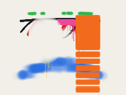
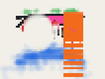
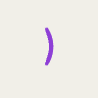

# Golden paint baseline (phase 0)

Recorded 2026-10-05 on `feat/multiplayer` at `c371829`, before any of the multiplayer paint refactors in `docs/multiplayer-audit.md` (section 7). It is the reference that every later step is compared against.

## How to run

```sh
npm run dev                 # in another terminal
npm run golden              # compare with scripts/golden-paint.json (exit 1 on a mismatch)
npm run golden -- --update  # rewrite the baseline (only when a change is meant to alter paint)
```

On this WSL machine Chromium needs `LD_LIBRARY_PATH=$HOME/.local/pwlibs/usr/lib/x86_64-linux-gnu` (missing system libraries, no sudo). `npm run check` needs it too, for the smoke test.

A run takes about four minutes in SwiftShader: roughly 28 s per detail to play, and as long again to replay (loopback, below). Face images land in `shots/golden/` (not committed). Copies of the baseline images are in `docs/golden/`.

## What it does

- Loads the demo level at each PAINT DETAIL (24, 48, 72, 96 texels/m) in a fresh page. CITY DETAIL is LOW because the city never takes paint.
- Stands 1 m from a paintable wall on the demo roof, at x = 3.4, z 1.9–4, up to 1.7 m high, and faces it.
- Seeds paint randomness with `seedPaintRandom(1)` and steps frames at a fixed 1/60 s through `window.game.fixedStep`. The paint then depends on the frame count, not on how fast the browser runs.
- Turns DRIPS on, unlocks every tool, color and cap, and plays 12 scripted runs:
  - the can with each cap, plus one run sputtering at low pressure;
  - the marker with three nibs (default, thinnest, widest);
  - the roller on the wall and on the floor;
  - the sponge at two sizes.

  Runs overlap on purpose, to cover layering, runs on wet paint and the sponge over paint.
- Hashes every paint atlas (CPU RGBA), keyed by its stable surface key (`PaintSurface.key`), so the order surfaces are registered in doesn't matter. It also checks that keys are unique and that `paint.find` returns each surface. It also records the total painted area, mean alpha, drip triggers and the coverage each run added. Coverage is m² of full-opacity paint; the sponge's is negative.
- **Loopback.** While playing, every paint op is recorded (`PaintSystem.log`, `src/paint-ops.ts`) along with which frame made it: stamps, rolls, and the runs the painter started. A fresh page at the same detail replays them frame by frame through `PaintOps.apply`. It must give the same hash: that's the remote-paint path, proven without a network. ULTRA's ops are also replayed at LOW, where the painted area must come within 10% of ULTRA's.
- Rendering is skipped by stubbing `renderer.render`. The paint is all on the CPU, so the hashes are the same either way, and the run is about 5× faster.

## Baseline

Hashes since the surface keys (`7f6dc6a`): the same paint as the phase 0 hashes, now keyed by surface key.

| Detail | Hash | Painted m² | Mean alpha | Drip triggers |
|---|---|---|---|---|
| LOW 24 | `339ceba05760b711` | 1.793 | 0.552 | 272 |
| MEDIUM 48 | `8d546806fb00cbd6` | 1.764 | 0.565 | 246 |
| HIGH 72 | `0ea7f0a79bb8c75d` | 1.817 | 0.567 | 212 |
| ULTRA 96 | `63b9b5cb9c7ea7e8` | 1.801 | 0.548 | 231 |

Coverage added per run, in m² of full paint (negative means removed):

| Run | LOW | MEDIUM | HIGH | ULTRA |
|---|---|---|---|---|
| can skinny | 0.107 | 0.102 | 0.102 | 0.103 |
| can standard | 0.237 | 0.225 | 0.232 | 0.224 |
| can fat, held for runs | 0.062 | 0.052 | 0.050 | 0.053 |
| can spray | 0.389 | 0.386 | 0.392 | 0.389 |
| can sputtering | 0.025 | 0.041 | 0.070 | 0.033 |
| marker (1.2 cm nib) | 0.073 | 0.031 | 0.029 | 0.032 |
| marker thinnest (1 texel) | 0.035 | 0.015 | 0.008 | 0.006 |
| marker widest, held for runs | 0.050 | 0.045 | 0.040 | 0.035 |
| roller on the wall | 0.233 | 0.267 | 0.277 | 0.276 |
| roller on the floor | 0.065 | 0.067 | 0.067 | 0.067 |
| sponge | −0.146 | −0.112 | −0.112 | −0.107 |
| sponge widest | −0.140 | −0.123 | −0.126 | −0.126 |

The wall at ULTRA and at LOW, then the floor (ULTRA), at 96 px/m over paper:

  

Loopback (since `e7a0bc1`): identical at all four details, about 5,100–5,300 ops over 1,377 frames. ULTRA's ops at LOW paint 1.842 m², 2.3% more than at ULTRA (1.801): LOW draws thin lines and runs a whole 4 cm texel wide.

## Findings

1. **The paint was not reproducible until the can jitter was seeded.** The audit lists the first-person can jitter (`src/spray/can-model.ts`) as visual only. But particles leave from the jittered nozzle, so the jitter changes their flight time and the order dabs land in. With drips on, it also changes which runs start, because excess builds up in that order. It now uses `paintRandom` too (`9a73958`). The other `Math.random` sites in the audit's section 3 are visual or audio only.
2. **Same detail is bit-exact.** Two runs at the same detail, each in a fresh page, give identical hashes at LOW and ULTRA. This holds once the paint randomness is seeded and `dt` is fixed. Nothing else was needed: no prop rebuilds happened during the runs, and the baker, lightning and other wall-clock effects don't reach paint.
3. **Comparing across details is approximate, and noisier than the raster alone explains.** Total painted area agrees within about 3% across the four details. Runs the audit predicts to differ do differ: at LOW the default marker line is 4 cm wide instead of about 2.4 cm (2.3×), and the thinnest line is 4 cm instead of 1 cm (6×). Two runs differ for an extra reason:
   - **Sputtering** varies from 0.025 to 0.070 m² between details.
   - **Drip triggers** don't follow detail (272, 246, 212, 231).

   The cause is that all paint randomness is **one shared stream**. Drip decisions draw one random number per saturated texel, and the number of texels depends on detail. So every later run, the sputter run included, draws different numbers at each detail.

   For future statistical comparisons, separate streams per purpose (spray, sputter, drips) would decouple the tools. This fits phase 1 step 4, when drips become ops decided by the painter.
4. **At LOW, the sponge removes more and the roller lays less.** The sponge removes about 30% more paint (−0.146 vs −0.107 m²), and the roller on the wall lays about 15% less (0.233 vs 0.276). The likely cause, not verified, is the coarse 4 cm texels: a scrub takes whole texels, and the roller's narrow press bands, between the slats (next point), round to fewer texels. Either way, this is how the game behaves today, not something these changes introduced.
5. **The demo wall has unpaintable slats.** They are 2 cm in front of the wall (part of the `building` prop), about every 12 cm from 0.3 to 0.95 m up. Strokes that cross them leave stripes, as the orange roller shows. It's correct occlusion, not a gap in the roller. The marker runs stay above the slats so their paint is easy to read.
6. **Vite test gotcha.** After a source file is edited while `npm run dev` runs, the game imports it as `file.ts?t=…`. `import('/src/file.ts')` from a test then loads a second copy with its own state. Use the exact URL from `performance.getEntriesByType('resource')`, or go through `window.game`.

## Using it in later steps

- Refactors that must not change paint (stable keys, sizes in per-player state, `stampFace` / `rollFace`, splitting `painting.ts`): `npm run golden` must report all details matching.
- Steps that change the order of random draws (drips becoming ops): the hashes will change. Compare the per-run coverage and drip numbers with this table instead, and the PNGs side by side. Then rewrite the baseline with `--update` in the same commit, and say so in the commit message.
- If the test scene changes (new runs, another wall), rewrite the baseline in its own commit, with no paint-path change in it.
